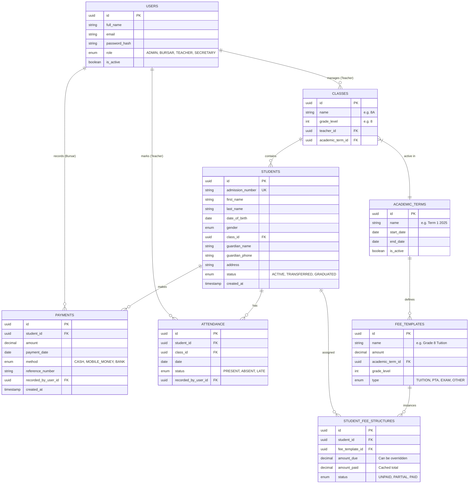

# Database Schema & API Design (Phase 1)

## 1. Entity-Relationship Diagram (ERD)

---

## 2. Database Schema Definitions (PostgreSQL)

### Core Tables

**`users`**
- `id`: UUID, Primary Key
- `email`: VARCHAR(255), Unique, Not Null
- `password_hash`: VARCHAR, Not Null
- `full_name`: VARCHAR(100)
- `role`: ENUM('SUPER_ADMIN', 'BURSAR', 'TEACHER', 'SECRETARY')
- `created_at`: TIMESTAMP DEFAULT NOW()

**`students`**
- `id`: UUID, Primary Key
- `admission_number`: VARCHAR(50), Unique (School specific ID)
- `first_name`: VARCHAR(50)
- `last_name`: VARCHAR(50)
- `class_id`: UUID, Foreign Key -> `classes.id`
- `guardian_name`: VARCHAR(100)
- `guardian_phone`: VARCHAR(20) (Indexed for search)
- `balance`: DECIMAL(10, 2) DEFAULT 0.00 (Cached field for performance)

**`classes`**
- `id`: UUID, Primary Key
- `name`: VARCHAR(20) (e.g., "Grade 8A")
- `grade_level`: INTEGER (e.g., 8)
- `teacher_id`: UUID, Foreign Key -> `users.id`

### Financial Tables

**`fee_templates`** (Standard fees for a group)
- `id`: UUID, Primary Key
- `name`: VARCHAR(100) (e.g., "Term 1 2025 Tuition")
- `amount`: DECIMAL(10, 2)
- `term_id`: UUID, Foreign Key -> `academic_terms.id`
- `applicable_grade`: INTEGER

**`payments`**
- `id`: UUID, Primary Key
- `student_id`: UUID, Foreign Key -> `students.id`
- `amount`: DECIMAL(10, 2)
- `method`: ENUM('CASH', 'MOMO', 'BANK')
- `reference`: VARCHAR(100)
- `recorded_by`: UUID, Foreign Key -> `users.id`
- `created_at`: TIMESTAMP DEFAULT NOW()

---

## 3. REST API Endpoints (Phase 1)

### Authentication
- `POST /api/v1/auth/login`
  - Body: `{ email, password }`
  - Response: `{ token, user: { id, role, name } }`

### Students
- `GET /api/v1/students`
  - Query Params: `?class_id=...`, `?search=name_or_adm_num`
  - Response: `[{ id, name, class, balance, ... }]`
- `POST /api/v1/students`
  - Body: `{ first_name, last_name, guardian_details, class_id }`
- `GET /api/v1/students/:id`
  - Response: Full profile + recent payments + attendance summary.
- `POST /api/v1/students/bulk-upload`
  - Body: Multipart/form-data (CSV)

### Classes
- `GET /api/v1/classes`
  - Response: `[{ id, name, teacher_name, student_count }]`

### Finance
- `GET /api/v1/finance/dashboard`
  - Response: `{ total_collected_today, total_outstanding, recent_transactions }`
- `POST /api/v1/payments`
  - Body: `{ student_id, amount, method, reference, date }`
  - Action: Creates payment record, updates student balance, updates fee status.
- `GET /api/v1/students/:id/statement`
  - Response: History of fees assigned vs payments made.

### Attendance
- `GET /api/v1/classes/:id/attendance`
  - Query: `?date=YYYY-MM-DD`
  - Response: List of students with current status for that date.
- `POST /api/v1/classes/:id/attendance`
  - Body: `{ date, records: [{ student_id, status }, ...] }`

---

## 4. Implementation Notes
- **ORM**: Prisma or TypeORM (Node.js) / Django ORM (Python).
- **Validation**: Zod (Node) / Pydantic (Python).
- **Security**: JWT for session management.
